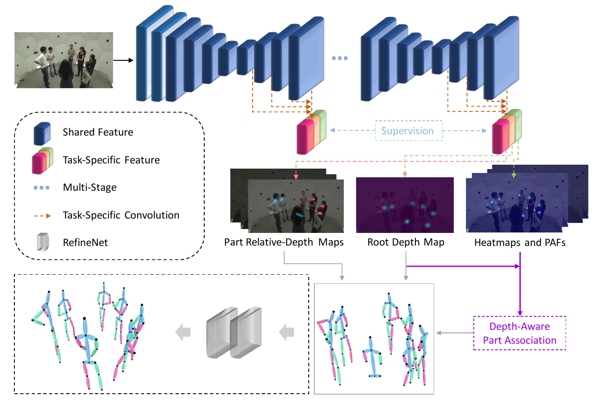

# SMAP: Single-Shot Multi-Person Absolute 3D Pose Estimation
> [SMAP: Single-Shot Multi-Person Absolute 3D Pose Estimation]()  
> Jianan Zhen\*, Qi Fang\*, Jiaming Sun, Wentao Liu, Wei Jiang, Hujun Bao, Xiaowei Zhou  
> ECCV 2020  
> [Project Page](https://zju3dv.github.io/SMAP/)  

## Introduction


## Requirements
- PyTorch >= 1.0
- gcc >= 6.0

## Start
```bash
# install requirements
pip3 install -r requirements.txt

# install depth-aware part association lib (c++ and cuda)
# requirement: gcc >= 6
cd extensions
# make the cuda path in setup.py right
python setup.py install
```

## Run inference on custom images
Our pretrained model can be downloaded from [SMAP](https://drive.google.com/file/d/1sGnT1y9DszpGS9wVFDhXG0LL61pKL7jX/view?usp=sharing) and [RefineNet](https://drive.google.com/file/d/1Hy3dr31FyVNgDB5UZ5VT_5_3urf_qwBW/view?usp=sharing).  
```bash
cd exps/stage3_root2
# vim test.sh
# set dataset_path
# set -t run_inference
# set -d test
bash test.sh
```
The result will be saved in a json file located in "model_logs/stage3_root2/result/". You can use the visualization code in "lib/visualize".

## Prepare Data for training  
Put all data under the "data/" folder with symbolic link according to the specified directory structure. Or you can change the path in "dataset/data_settings.py".
```
$PROJECT_HOME
|-- data
|   |-- coco2017
|   |   |-- annotations
|   |   |-- train2017
|   |-- MuCo
|   |   |-- annotations
|   |   |-- images
|   |-- ...
```    
Sources: MuCo is provided by [Moon](https://github.com/mks0601/3DMPPE_POSENET_RELEASE).  
Only the mpi15 skeleton is supported for all stages now. Our data formats (annotation json, keypoint ordering, etc.) are in [lib/preprocess/data_format.md](lib/preprocess/data_format.md). We convert all datasets to our format. 

## Train
```bash
# step 1: train smap network
cd exps/stage3_root2
# vim train.sh
# change the $PROJECT_HOME to the absolute path of the project
# set $CUDA_VISIBLE_DEVICES and nproc_per_node if using distributed training
bash train.sh

# step 2: generate training data for refinenet
# vim test.sh
# set -t generate_train
# set -d generation (if using training data); -d test (if using test data)
bash test.sh

# step 3: train refinenet
cd exps/refinenet_root2
bash train.sh
```

## Acknowledgements
We would like to thank Qing Shuai, Zhize Zhou and Zichen Tian for their help.

